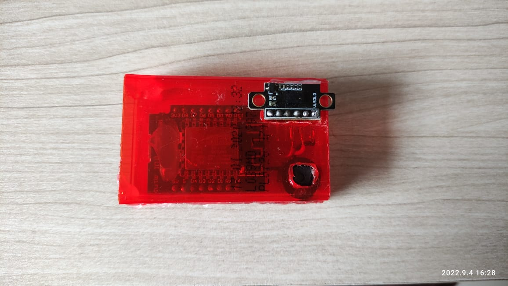
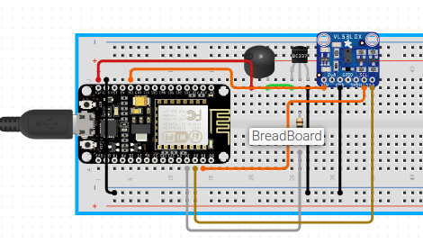

 

  <h3 align="center">The Pet Passed</h3>
  

    A project I made to make it beep when my dog was on the porch (his bathroom).
     
    :warning: If I had to do it again, I would use ultrasonic sensor instead of VL53L0X, because it works better in the dark.:warning:
     
     
    <a href="https://github.com/xandao-dev/the-pet-passed"><strong>Explore the docs »</strong></a>
     
    <a href="https://github.com/xandao-dev/the-pet-passed/issue">Report Bug</a>
    ·
    <a href="https://github.com/xandao-dev/the-pet-passed/issues">Request Feature</a>
  

<!-- TABLE OF CONTENTS -->

  
Table of Contents

  <ol>
    <li>
      <a href="#about-the-project">About The Project</a>
      <ul>
        <li><a href="#features">Features</a></li>
        <li><a href="#built-with">Built With</a></li>
      </ul>
    </li>
    <li><a href="#roadmap">Roadmap</a></li>
    <li><a href="#contributing">Contributing</a></li>
    <li><a href="#license">License</a></li>
    <li><a href="#contact">Contact</a></li>
  </ol>

<!-- ABOUT THE PROJECT -->
## About The Project

https://user-images.githubusercontent.com/22106326/188333202-d2fcdfac-8c87-434c-b8e7-aff0ebde3c7a.mp4

  

### Features

* Beep when the pet passes in front of the sensor
* Min and max range, to match with the door

### Built With

* [Arduino](https://www.arduino.cc/) - Arduino programming language
* [Wemos D1 Mini](https://www.wemos.cc/en/latest/d1/d1_mini.html) - ESP12F microcontroller (based on ESP8266)
* [VL53L0X](https://www.pololu.com/product/2490) - Mini linear lidar sensor
* [Buzzer](https://www.adafruit.com/product/160) - Piezo Buzzer

<!-- ROADMAP -->
## Roadmap

See the [open issues](https://github.com/xandao-dev/the-pet-passed/issues) for a list of proposed features (and known issues).

<!-- CONTRIBUTING -->
## Contributing

Contributions are what make the open source community such an amazing place to be learn, inspire, and create. Any contributions you make are **greatly appreciated**.

1. Fork the Project
2. Create your Feature Branch (`git checkout -b feature/AmazingFeature`)
3. Commit your Changes (`git commit -m 'Add some AmazingFeature'`)
4. Push to the Branch (`git push origin feature/AmazingFeature`)
5. Open a Pull Request

<!-- LICENSE -->
## License

Distributed under the MIT License. See [LICENSE](./LICENSE.md) for more information.

Free software =)

<!-- CONTACT -->
## Contact

Alexandre Calil - [Linkedin](https://www.linkedin.com/in/xandao-dev/) - [alexandre@xandao.dev](mailto:alexandre@xandao.dev)

Project Link: [https://github.com/xandao-dev/the-pet-passed](https://github.com/xandao-dev/the-pet-passed)
